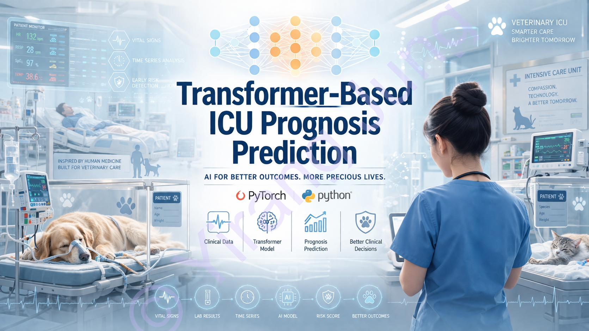

# MIMIC Transformer Clinical AI

Author: YIRANG JUNG  

All Rights Reserved © Yirang Jung (2026)

## Transformer-Based Clinical Time-Series Modeling

Transformer architecture applied to ICU clinical time-series data for:

- Vital sign sequence modeling
- Next-step prediction
- ICU mortality prediction

---

## Tech Stack

Python | PyTorch | Pandas | NumPy | Transformer | Clinical Data | Time-Series Modeling

---

## Key Features

- MIMIC-IV clinical dataset preprocessing pipeline
- ICU stay-based time-series extraction
- Multi-stay dataset construction
- Transformer-based sequence modeling
- Mortality prediction (binary classification)
- Early stopping + regularization

---

## Project Structure

---

## Pipeline Overview

1. Raw MIMIC-IV data loading  
2. ICU stay filtering  
3. Vital sign extraction  
4. Time-series transformation  
5. Sequence generation  
6. Transformer model training  
7. Mortality prediction  

---

## Model

- Input: (sequence_length=100, features=7)
- Architecture:
  - Linear embedding
  - Positional encoding
  - Transformer Encoder
  - Fully connected classifier

---

## Tasks

### 1. Regression (Pretraining)
Predict next-step vital signs

### 2. Classification
Predict ICU mortality (binary)

---

## Limitations

- Demo dataset → limited sample size
- Mortality prediction performance constrained
- Intended as pipeline + architecture demonstration

---

## Author

Yirang Jung
Veterinarian · Medical Researcher · AI Big Data Specialist
---

## License

All Rights Reserved © Yirang Jung 2026
All images and visual materials in this repository are protected by copyright. Unauthorized use, reproduction, or distribution is prohibited.
